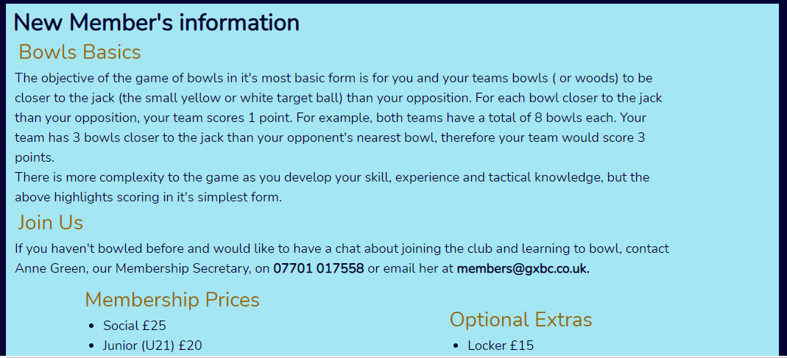
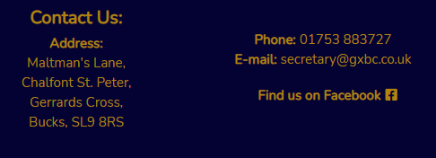
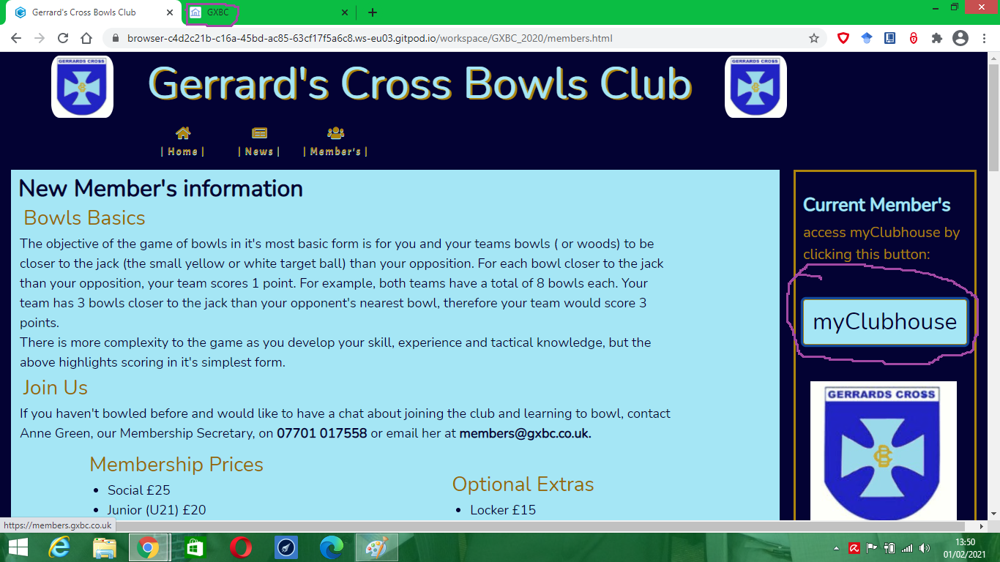

# Gerrards Cross Bowls Club Website

####  A link to site is here: [Gerrards Cross Bowls Club](https://tjones305.github.io/GXBC_2020/) 

 **This is the new main website for Gerrards Cross Bowls Club. It is designed to be responsive and accessible on a range of devices, making it easy to navigate for potential new members be they youthful or of the elder generation.**

> ### User Experience (UX) User stories

### First Time Visitor Goals 
- As a First Time Visitor, I want to easily understand the main purpose of the site and learn more about Gerrards Cross Bowls Club. 
- As a First Time Visitor, I want to be able to easily navigate throughout the site to find content. 
- As a First Time Visitor, I want to look for information that allows me to see what the club are about other than bowls. I also want to locate external links to national and county affiliations to determine how renown the club is and know how they are viewed in the wider bowls community.

### Prospective Member Goals 
- As a Prospective Member, I want to find information about coaching, membership and media that would aid my enthusiasm and theorectical knowledge of bowls. 
- As a Prospective Member, I want a variety of ways to get in contact with the club with any questions I may have. 
- As a Prospective Member, I want to have a contact should I wish to apply to sign up.

### Current Member Goals 
- As a Current Member, I want to access the current members site at myClubhouse from the main site. 
- As a Current Member, I want to check to see if there is any updated news. 
- As a Current Member, I want to easily access external links that provide me with additional bowls information.

> ## Design 

### Colour Scheme 
The three main colours used are Gerrards Cross dark blue, gold and light blue.

### Typography 
The Nunito font is the main font used throughout the whole website with Sans Serif as the fallback font in case for any reason the font isn't being imported into the site correctly. Nunito is a modern, crisp and rounded font, which makes it clear to read and is ideal to attract both young and older users.

### Imagery 
Imagery is important. The carousel hero image is designed to be the centerpeice and catch the user's attention. It also has a modern, energetic aesthetic.

### Wireframes 
- Home Page Wireframe

1. Desktop

2. Tablet

3. Mobile

- News Page Wireframe

1. Desktop

2. Tablet

3. Mobile

- Members Page Wireframe

1. Desktop

2. Tablet

3. Mobile

### Features
- Responsive on most devices sizes 1366px width and lower - this includes mobiles, tablets and laptops 
- Interactive elements (carousel, Google Maps, hover functionality on coach pictures and the GXBC logo in the header)

> ## Technologies Used 

### Languages Used 
HTML5 
CSS3

### Frameworks, Libraries & Programs Used 

- Bootstrap 4.4.1: Bootstrap was used to assist with the responsiveness and styling of the website. Specific features include - navbar carousel, containers, carddecks/tiles. 

- Hover.css: Hover.css was used on the Social Media icons in the footer to add the float transition while being hovered over. 

- Google Fonts: Google fonts were used to import the 'Nunito' font into the style.css file which is used on all pages throughout the project. 

- Font Awesome: Font Awesome was used on all pages throughout the website to add icons for aesthetic and UX purposes. 

- jQuery: jQuery came with Bootstrap to make the navbar responsive but was also used for the carousel function in JavaScript. 

- popper.min.js: popper.min.js was required for the carousel to function. 

- Git Git was used for version control by utilizing the Gitpod terminal to commit to Git and Push to GitHub. 

- GitHub: GitHub is used to store the projects code after being pushed from Git. 

- Balsamiq: Balsamiq was used to create the wireframes during the design process. 

> ### Testing 
The W3C Markup Validator and W3C CSS Validator Services were used to validate every page of the project to ensure there were no syntax errors in the project.

### W3C Markup Validator

### W3C CSS Validator  

	The result of the CSS validator highlighted 2 errors, both of these errors are associated with Bootstrap's CDN, which the developer hasn't access to change. 

### Lighthouse 

> ## Testing User Stories from User Experience (UX) Section

##  First Time Visitor Goals  
- As a First Time Visitor, I want to easily understand the main purpose of the site and learn more about Gerrards Cross Bowls Club. 
	
Upon entering the site, users are automatically greeted with a simple,clear and visual navigation bar to go to the page of their choice. 
- Desktop 

- Tablet

- Mobile

Below there is welcoming club summary and an image carousel which advertises the club as accessible for all levels and ages. 
The User gains their intially needs from the summary and images, after which they can either scroll down to the map to see the club location or choose to visit one of the other webpages for further information. 
	
- As a First Time Visitor, I want to be able to easily navigate throughout the site to find content.

The site has been designed to be easily accesible so that somebody with low compentency in using technology can navigate with confidence. 
At the top of each page there is a navigation bar comprising of clear text accompanied with an icon to signpost what the User can resonably expect to find clearly. 

On the bottom of each page are links to club affiliations allowing Users to gain additional information form external sites. These links will open in a new tab so the user does not lose their place on the site.

The Members page is the heaviest for content comprising of membership details, a simple explaination of the game of bowls and video content to aid in understanding a theorectical knowledge. The layout is clearly labelled for each section allowing the User to browse the site as required. 

- As a First Time Visitor, I want to look for information that allows me to see what the club are about other than bowls. I also want to locate external links to national and county affiliations to determine how renown the club is and know how they are viewed in the wider bowls community.

When on the site Users will see the images on the carousel which give a realistic taste of club life.

 

On the news page there are 3 clearly defined boxes for differnt type of news labelled competition, social and member.

 

At the bottom of all pages are the club affiliations so they are easily accessible regardless of what page the user finds themselves on.

### Prospective Member Goals 

- As a Prospective Member, I want to find information about coaching, membership and media that would aid my enthusiasm and theorectical knowledge of bowls.

Using the navigation bar at the top it is easy to navigate to the members page.

Once on the members page a prospective member would see * new member's information * as a heading, making it clear for the user where to go for this information. 

Under this section you find the * coaching * section, again clearly labelled.

The next section is full of media links with descriptions outlining the content a video link might play. 

- As a Prospective Member, I want a variety of ways to get in contact with the club with any questions I may have.

Prospective members who wish to contact the club have the club address, phone number and secretary e-mail at the bottom of each page labelled 'contact us'.

On the member's page in the new member's section there are contact details in bold.

 
- As a Prospective Member, I want to have a contact should I wish to apply to sign up.

On the member's page this is clearly signposted by emphasising the information in bold, along with the contact name (see above image).

### Current Member Goals 

- As a Current Member, I want to access the current members site at myClubhouse from the main site.
 
When navigated to the member's page the current members button is clear to see on the right hand side due to its differentiation in colour scheme (dark blue background, light blue text).

After clicking on the button the current member will have the myClubhouse site open in a new tab.

- As a Current Member, I want to check to see if there is any updated news.
On the navigation bar news is clearly labelled.

 

Once on the page current members have three sections which are labelled and have their own unique icon, making it simple to access the information they require.

- As a Current Member, I want to easily access external links that provide me with additional bowls information.

At the bottom of every page their is a footer which content is consistent throughout all pages.
- Index 

- News 

- Members 

As a current member the most relevant section will be affiliations to access competition progress and submit results, this section is clearly titled and labelled with respective association badges to act as a visual aid.

Each affiliation link opens in a new tab:

- Bowls England 

- Buckinghamshire Bowls Association 

- London and Southern Counties Bowls Association 

## Further Testing 
- The Website was tested on Google Chrome, Microsoft Edge and Safari browsers. 
- The website was viewed on a variety of devices such as Desktop, Laptop, iPad Air & iPhoneX. other devices were tested through the inspect web developer tools.

##  Known Bugs 
On mobile devices with screen width of 280 pixels the current members button slightly covers over the h2 element as the screen squashes together.

> ## Deployment 

### GitHub Pages  
The project was deployed to GitHub Pages using the following steps...

1. Log in to GitHub and locate the GitHub Repository 
2. At the top of the Repository (not top of page), locate the "Settings" Button on the menu. This will be cog looking icon in the top-right. 
3. Scroll down the Settings page until you locate the "GitHub Pages" Section. 
4. Under "Source", click the dropdown called "None" and select "Master Branch". 
5. The page will automatically refresh. 
6. Scroll back down through the page to locate the now published site link in the "GitHub Pages" section. 

### Forking the GitHub Repository 
By forking the GitHub Repository we make a copy of the original repository on our GitHub account to view and/or make changes without affecting the original repository by using the following steps...

1. Log in to GitHub and locate the GitHub Repository 
2. At the top of the Repository (not top of page) just above the "Settings" Button on the menu, locate the "Fork" Button.
3. You should now have a copy of the original repository in your GitHub account.

### Making a Local Clone  
1. Log in to GitHub and locate the GitHub Repository Under the repository name, click "Clone or download". 
2. To clone the repository using HTTPS, under "Clone with HTTPS", copy the link. 
3. Open Git Bash Change the current working directory to the location where you want the cloned directory to be made. 
4. Type git clone, and then paste the URL you copied in Step 3. $ git clone https://github.com/YOUR-USERNAME/YOUR-REPOSITORY Press Enter. 
5. Your local clone will be created. $ git clone https://github.com/YOUR-USERNAME/YOUR-REPOSITORY

Cloning into CI-Clone... remote: Counting objects: 10, done. remote: Compressing objects: 100% (8/8), done. remove: Total 10 (delta 1), reused 10 (delta 1) Unpacking objects: 100% (10/10), done. Click Here to retrieve pictures for some of the buttons and more detailed explanations of the above process.

> ### Credits  

- Bootstrap4: Bootstrap Library used throughout the project mainly to make site responsive using the Bootstrap Grid System.

- MDN Web Docs : For Pattern Validation code. Code was modified to better fit my needs.

- Content: All content was written by the developer. For a small section of code (hover fucitionality) there is credit given in the acknowledgements section.

#### Media Images came from a variety of sources. 
Credit goes to the following:

- Gerrards Cross Bowls Club - pictures for carousel and coaches
- Buckinghamshire Bowls Association - logo on footer and news pages
- Bowls England- logo on footer and news pages
- Liberal Democrats - COVID-19 safety picture on news page.

#### Card Deck images can be found at the following:
- Introduction - <https://ied.eu/project-updates/beginning-critical-fo-in-company/>
- Delivery - <http://www.elthambowlingclub.co.uk/shared/attachments.asp?f=d61771fd%2D3929%2D4ca%2D8e05%2D26c61e66cc0f%2Epdf&o=Bowls%5Fbiomechanics%2D%2D%2DRob%2DJudson%2Epdf>
- Common Faults - <https://www.shareicon.net/fault-problem-error-cancel-exit-danger-alert-107468>
- Draw - <https://hertsbowlingclub.co.uk/coaching/>
- Controlled Weight - <http://clearwaterlawnbowlingclub.org/public/tactics.pdf>
- Run Shot - <https://www.pottersholidays.com/world-bowls/>
- Drive - <https://www.bigstockphoto.com/image-92709755/stock-vector-bang-comic-book%2C-cartoon-explosion>
- Bowls Exercises - <https://www.jackhighbowls.com/help/lawn-bowls-exercises>
- Conclusion - <https://www.word-nerds.com.au/speech-writing-tips/>

#### Video links were embedded from Youtube 
Credit goes to the video creators:
- Bowls Manawantu 
- Canadian Bowls Association

> ## Acknowledgements 
- My Mentor Gerry McBride for continuous useful feedback.

- Student support at Code Institute for their helpful advice and guidance.

- WS3 Schools for assistance in applying Google Maps.

- banzomaikaka for hover functionality code on the coaching section (solution comment on https://www.xspdf.com/help/50382383.html).     

> ### Limitations:
The developer only had access to a laptop as the largest screen size (1366px pixel width), therefore larger screen sizes may display pages differently to how they are intented.

> ### Future Additions:
1. I have plans to add pages in the future, however I felt that they weren't paramount to the site meeting it's initial purpose.
Below is the code I had constructed for the icons to these pages in preparation should I have had the time to do another page:

        <li class="list-inline-item menubar-color menuitem">
        <a href="competition.html"><i class="fa fa-trophy" aria-hidden="true"></i>| Play Bowls |</a>
        </li>
        <li class="list-inline-item menubar-color menuitem">
        <a href="#"><i class="fa fa-book" aria-hidden="true"></i>| About Us  |</a>
        </li>
        <li class="list-inline-item menubar-color menuitem">
        <a href="#"><i class="fa fa-medal" aria-hidden="true"></i>| Honours |</a>
        </li>

2. Responsive Design for devices larger than 1366px width may need changes made in the future.

### Other Functionality for future update:
- Live Score function:

A request from Gerrard's Cross Bowls Club was to have a function where they could add the score of a group of matches and it update on the index page of the site as a breaking news story. I felt that while it would be a useful feature, I don't currently have 
the knowledge required to make this possible, however I do believe that this is a possible feature to add in the future.

- Link with myClubhouse:

Gerrard's Cross Bowls Club have a second site which is aimed at current members and requires credentials to access. On the myClubhouse site, members can currently access membership options, submit competition entries & pay for both forementioned. 
It is the club's wish that the sign in functionality is added in the member's section instead of a button which links to the site. Similarly to the Live score function I belive this is a possibility in the future, however at this point in time I haven't the knowledge required
for this task. 